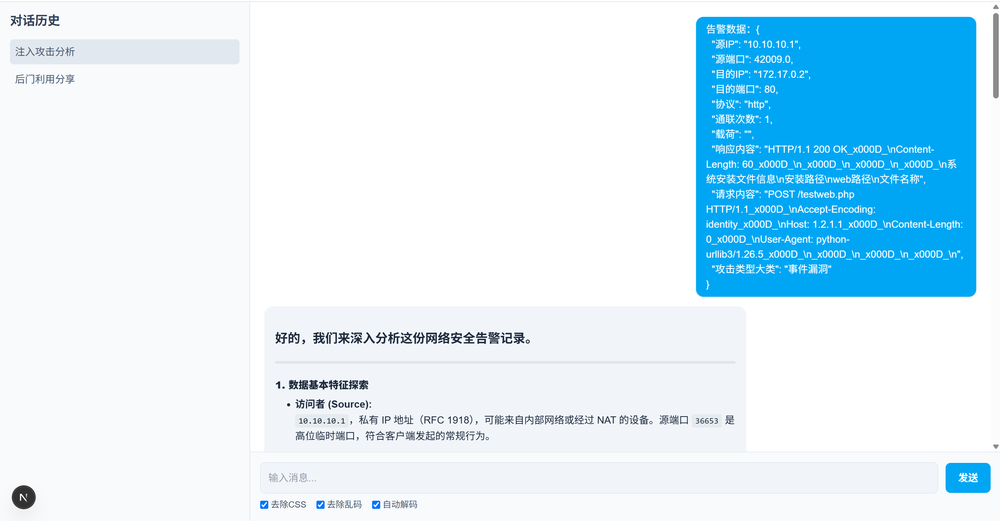

# 网络告警研判大模型

一个基于 Next.js 开发的类似 ChatGPT 的网络安全告警研判大模型应用，提供对话式界面进行网络安全告警的分析和解读。

## 预览



## 功能特性

- 现代、简洁的类 ChatGPT 界面
- 左侧会话历史栏
- 支持 Markdown 格式的消息显示
- 提供告警数据处理选项（去除 CSS、去除乱码、自动解码）
- 响应式设计，适应不同尺寸的设备

## 安装

确保您的系统已安装 Node.js (v16.0.0 或更高版本)。

1. 克隆仓库：

```bash
git clone <仓库地址>
cd network-alarm-llm
```

2. 安装依赖：

```bash
npm install
```

3. 运行开发服务器：

```bash
npm run dev
```

4. 打开浏览器访问 [http://localhost:3000](http://localhost:3000)

## 技术栈

- **Frontend Framework**: [Next.js](https://nextjs.org/) - React 框架
- **CSS Framework**: [Tailwind CSS](https://tailwindcss.com/) - 实用优先的 CSS 框架
- **Markdown Rendering**: [React Markdown](https://github.com/remarkjs/react-markdown) - React 的 Markdown 组件

## 依赖要求

主要依赖：

```json
"dependencies": {
  "next": "15.3.2",
  "react": "^19.0.0",
  "react-dom": "^19.0.0",
  "react-markdown": "^10.1.0",
  "rehype-raw": "^7.0.0",
  "remark-gfm": "^4.0.1"
}
```

开发依赖：

```json
"devDependencies": {
  "@eslint/eslintrc": "^3",
  "@tailwindcss/postcss": "^4",
  "@types/node": "^20",
  "@types/react": "^19",
  "@types/react-dom": "^19",
  "@types/uuid": "^10.0.0",
  "eslint": "^9",
  "eslint-config-next": "15.3.2",
  "tailwindcss": "^4",
  "typescript": "^5",
  "uuid": "^11.1.0"
}
```

## 项目结构

```
network-alarm-llm/
├── src/
│   ├── app/
│   │   ├── components/
│   │   │   ├── ChatInput.tsx      # 聊天输入框组件
│   │   │   ├── ChatSidebar.tsx    # 左侧会话历史栏组件
│   │   │   ├── Message.tsx        # 消息显示组件
│   │   │   └── MessageList.tsx    # 消息列表组件
│   │   ├── globals.css            # 全局样式
│   │   ├── layout.tsx             # 布局组件
│   │   └── page.tsx               # 主页面
├── public/                        # 静态资源
├── .gitignore
├── next.config.js
├── package.json
├── README.md
└── tsconfig.json
```

## 使用说明

1. 在主界面的输入框中键入消息
2. 可根据需要选择处理选项（去除 CSS、去除乱码、自动解码）
3. 点击发送按钮或按 Enter 键发送消息
4. 系统会以 Markdown 格式显示回复内容
5. 历史会话可以在左侧栏中查看和选择

## 自定义与扩展

- **添加新功能**: 修改 `src/app/page.tsx` 中的状态管理和处理函数
- **调整样式**: 编辑 `src/app/globals.css` 或组件中的 Tailwind 类
- **添加新组件**: 在 `src/app/components/` 目录下创建新组件

## 贡献

欢迎提交 Issue 和 Pull Request 来帮助改进项目！

## 许可

[MIT](LICENSE)
